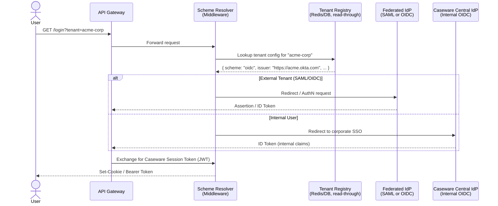

# High-Level Architecture: Caseware Collaborate — Authorization Layer

> **Scope:** Multi-tenant SaaS authorization — dynamic OIDC/SAML scheme routing and high-throughput permission checks at 10,000+ req/s with sub-second revocation.
> **Assumed:** Caseware's central Identity Provider (IdP) and all federated SAML/OIDC providers are pre-existing. This document covers the authorization plane only.

---

## 1. Authentication Routing — Dynamic OIDC/SAML Scheme Selection

Caseware Collaborate serves two user populations: **internal** users (Caseware employees, SSO via corporate IdP) and **external federated** users (customer tenants, each with their own SAML/OIDC IdP). The challenge is routing each request to the correct identity scheme dynamically, without hardcoding provider configuration.

### Scheme Resolution Flow



### Key Design Decisions

| Concern | Decision | Rationale |
|---|---|---|
| Scheme registration | Tenant config stored in DB, cached in Redis (5 min TTL) | Avoids per-request DB reads; OIDC metadata pre-fetched at cache warm |
| Dynamic scheme loading | `IAuthenticationSchemeProvider` overridden at runtime | ASP.NET Core allows named schemes registered at startup + dynamic addendum |
| Token normalization | All upstream tokens exchanged for a short-lived internal JWT | Single, uniform token format downstream regardless of upstream IdP type |
| Internal vs. external routing | `tenant_id` claim + `idp_type` claim on the normalized JWT | Downstream services need only inspect claims — no IdP-awareness required |

---

## 2. High-Throughput Authorization — L1/L2 Cache + User Epoch Pattern

### Target: 10,000+ checks/sec · Sub-second revocation · WebSocket support

```mermaid
flowchart TD
    subgraph Request["Inbound Request (HTTP or WebSocket)"]
        R[Authenticated Request\njwt.sub = user-123\njwt.perm_epoch = 42]
    end

    subgraph L1["L1 — In-Process Memory Cache (per API pod)"]
        L1C[("MemoryCache\nKey: user-123\nEpoch: 42\nTTL: 1–2 sec")]
    end

    subgraph L2["L2 — Redis Cluster"]
        L2C[("Redis Key: perm:user-123\n{ epoch: 42, permissions: [...] }\nTTL: 60 sec")]
    end

    subgraph DB["Primary DB (PostgreSQL)"]
        DBC[(Permissions Table)]
    end

    subgraph Events["Event Bus (Kafka / Redis Pub/Sub)"]
        EVT[perm.revoked event\n{ user_id, new_epoch }]
    end

    subgraph WS["WebSocket Manager"]
        WSM[Active WS connections\nIndexed by user_id]
    end

    R -->|"1. Check L1"| L1C
    L1C -->|"HIT + epoch match ✓"| ALLOW[✅ Authorize]
    L1C -->|"MISS or epoch mismatch"| L2C
    L2C -->|"HIT + epoch match ✓"| L1C
    L2C -->|"MISS or epoch mismatch"| DBC
    DBC -->|"Load + new epoch"| L2C
    L2C -->|"Populate L1"| L1C

    DBC -->|"Permission change triggers"| EVT
    EVT -->|"Invalidate Redis key\nIncrement epoch"| L2C
    EVT -->|"Notify → force re-auth or disconnect"| WSM
```

### Authorization Check — Detailed Flow

```
Request arrives with JWT:
  { sub: "user-123", perm_epoch: 42, tenant_id: "acme" }

STEP 1 — L1 (In-Memory, ~0.01ms):
  Key = "user-123:42"
  HIT  → return cached PermissionSet  ✅ Done
  MISS → proceed to L2

STEP 2 — L2 (Redis, ~1–3ms):
  GET perm:user-123
  HIT, epoch == 42  → populate L1 (TTL=2s), return PermissionSet  ✅ Done
  HIT, epoch != 42  → JWT is stale; return 401 (token needs refresh)
  MISS              → proceed to DB (cache stampede mitigation: Redis SETNX lock)

STEP 3 — DB (PostgreSQL, ~10–30ms):
  SELECT permissions WHERE user_id = 'user-123'
  Write result + current epoch to Redis (TTL=60s)
  Populate L1 (TTL=2s)
  Return PermissionSet  ✅ Done
```

### Revocation Path (Sub-second)

```
Event: User "user-123" permission changed
  1. DB transaction updates permissions + increments perm_epoch → 43
  2. Publish event: { type: "perm.revoked", user_id: "user-123", new_epoch: 43 }
  3. Event Consumer:
       a. DEL perm:user-123 from Redis           (L2 invalidated)
       b. All API pods' L1 entries expire in ≤2s (natural TTL)
  4. WebSocket Manager receives event:
       a. Finds all active WS connections for "user-123"
       b. Sends revocation frame → client must re-authenticate
       c. Closes connection if client does not re-auth within grace period
```

> **Revocation Latency:** Redis invalidation is near-instant. Maximum stale window = L1 TTL = **≤2 seconds**.

---

## 3. Failure Modes & Tradeoffs

| Failure Mode | Risk | Mitigation |
|---|---|---|
| **Cache Stampede** | Redis MISS for popular user triggers parallel DB floods | Per-key mutex via `SETNX` / Redis redlock; single-flight pattern in C# (`SemaphoreSlim` per key) |
| **Redis Outage** | L2 unavailable → all requests fall through to DB | Circuit breaker (Polly); graceful degradation to DB-only; alert on latency spike. **Do not fail open.** |
| **L1 Stale Window** | Up to 2s of stale permissions after revocation | Acceptable per ADR. For zero-tolerance resources, skip L1 and force L2 check with epoch validation |
| **JWT Epoch Drift** | Token carries stale epoch after permission change | Issuing a new token is the only fix; client must call `/token/refresh`. 401 on epoch mismatch drives this |
| **WebSocket Revocation Loss** | Event bus drops the revocation event | WS connections carry a `connection_epoch`; server-side heartbeat re-validates epoch every N seconds as a safety net |
| **Thundering Herd on Startup** | Pod restart with empty L1 causes burst to Redis/DB | Pre-warm L1 on startup for active sessions; stagger pod rollouts |
| **Multi-tenant Data Bleed** | Wrong permissions served across tenants | Cache key MUST include `tenant_id`: key = `perm:{tenant_id}:{user_id}:{epoch}` |

---

## 4. Component Responsibilities Summary

| Component | Role |
|---|---|
| **API Gateway** | TLS termination, tenant header injection, coarse rate limiting |
| **Scheme Resolver Middleware** | Dynamic OIDC/SAML scheme lookup and token normalization |
| **Authorization Middleware** | L1 → L2 → DB cascade; epoch validation; `IPermissionService` contract |
| **Redis Cluster (L2)** | Distributed permission snapshot store; epoch source of truth |
| **In-Memory Cache (L1)** | Ultra-low latency, per-pod permission cache; 1–2s TTL |
| **Event Bus** | Delivers `perm.revoked` events to all consumers reliably |
| **WebSocket Manager** | Maintains user→connection index; handles forced revocation frames |
| **Tenant Registry** | Maps `tenant_id` → IdP config; cached read-through in Redis |
