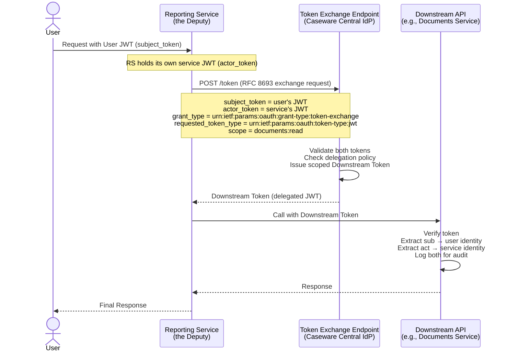

# Design Spec: OAuth 2.0 Token Exchange for Service Delegation
## Solving the Confused Deputy Problem in Caseware Collaborate

> **RFC Reference:** [RFC 8693 — OAuth 2.0 Token Exchange](https://datatracker.ietf.org/doc/html/rfc8693)
> **Problem:** An internal Collaborate service (e.g., `reporting-service`) must call a downstream API on behalf of an authenticated user without acquiring that user's full permissions or masking its own identity.

---

## 1. The Problem — Confused Deputy, Illustrated

Without Token Exchange, a naïve implementation looks like this:

```
User ──► Reporting Service ──► Downstream API
                │
                └─ forwards the USER's original token
                   (Downstream API cannot distinguish:
                    "Is this the user acting directly,
                     or a service acting on their behalf?")
```

**The deputy (Reporting Service) gains the user's full authority without accountability.** If the service is compromised or misbehaves, the audit log shows only the user's `sub` — the service is invisible.

---

## 2. Solution — RFC 8693 Token Exchange

The exchange endpoint at Caseware's central IdP issues a new **Downstream Token** that simultaneously proves:

1. **Who the original subject is** (`sub` — the user, preserved and unmodified)
2. **Who the intermediary actor is** (`act` — the delegating service, cryptographically bound)



---

## 3. Token Payloads — Exact Structure

### 3a. Subject Token (User's Original JWT)
> Presented by the Reporting Service as proof of the user's identity.

```json
{
  "iss": "https://idp.caseware.com",
  "sub": "user-7f3a9c",
  "aud": "collaborate-api",
  "iat": 1753999200,
  "exp": 1754002800,
  "tenant_id": "acme-corp",
  "perm_epoch": 42,
  "scope": "collaborate:read collaborate:write documents:read"
}
```

### 3b. Actor Token (Reporting Service's Own JWT)
> The service's own identity credential — a machine-to-machine JWT issued to the service at startup via Client Credentials flow.

```json
{
  "iss": "https://idp.caseware.com",
  "sub": "svc:reporting-service",
  "aud": "https://idp.caseware.com/token",
  "iat": 1753999200,
  "exp": 1754085600,
  "client_id": "reporting-service",
  "service_version": "2.4.1"
}
```

### 3c. Token Exchange Request (HTTP)

```http
POST /token HTTP/1.1
Host: idp.caseware.com
Content-Type: application/x-www-form-urlencoded

grant_type=urn:ietf:params:oauth:grant-type:token-exchange
&subject_token=<user-jwt>
&subject_token_type=urn:ietf:params:oauth:token-type:jwt
&actor_token=<service-jwt>
&actor_token_type=urn:ietf:params:oauth:token-type:jwt
&requested_token_type=urn:ietf:params:oauth:token-type:jwt
&audience=documents-service
&scope=documents:read
```

> **Scope Constraint:** The exchange endpoint enforces that the requested `scope` is a **strict subset** of the `subject_token`'s scope. A service cannot escalate the user's permissions — it can only narrow them.

### 3d. Downstream Token (Derived Delegated JWT) ✅
> This is the token the Reporting Service presents to the Documents Service.

```json
{
  "iss": "https://idp.caseware.com",
  "sub": "user-7f3a9c",
  "aud": "documents-service",
  "iat": 1753999210,
  "exp": 1753999510,
  "tenant_id": "acme-corp",
  "perm_epoch": 42,
  "scope": "documents:read",
  "act": {
    "sub": "svc:reporting-service",
    "client_id": "reporting-service",
    "service_version": "2.4.1"
  }
}
```

---

## 4. The `act` Claim — Anatomy and Audit Semantics

The `act` claim is the mechanism that solves the Confused Deputy problem.

```
┌─────────────────────────────────────────────────────────────┐
│                    DOWNSTREAM TOKEN                          │
│                                                              │
│  "sub": "user-7f3a9c"       ← WHO the action is FOR         │
│                                (user identity, immutable)    │
│                                                              │
│  "act": {                   ← WHO is EXECUTING the action    │
│    "sub": "svc:reporting"       (service identity, bound)    │
│  }                                                           │
│                                                              │
│  "scope": "documents:read"  ← WHAT is permitted             │
│                                (narrowed, not escalated)     │
│                                                              │
│  "aud": "documents-service" ← WHERE it is valid             │
│                                (audience-locked)             │
└─────────────────────────────────────────────────────────────┘
```

**Audit log entry produced by the Downstream API:**

```json
{
  "timestamp": "2026-08-01T20:17:00Z",
  "action": "document.read",
  "resource_id": "doc-abc123",
  "tenant_id": "acme-corp",
  "subject": "user-7f3a9c",
  "actor": "svc:reporting-service",
  "delegation": true,
  "scope_used": "documents:read"
}
```

Both `subject` and `actor` are captured. Forensic analysis can answer:
- *"What did user X access?"* → filter by `subject`
- *"What did the reporting service do on behalf of users?"* → filter by `actor`
- *"Did any service act without a delegating user?"* → filter `delegation = false`

---

## 5. Security Constraints Enforced by the Exchange Endpoint

| Constraint | Rule | Enforcement |
|---|---|---|
| **Scope never escalates** | `requested_scope ⊆ subject_token.scope` | Token Exchange endpoint rejects requests violating this |
| **Audience is explicit** | `aud` is set to the specific downstream service | Services cannot present this token to unintended audiences |
| **Short-lived delegation** | Downstream Token TTL ≤ 5 minutes | Limits blast radius if token is leaked; never longer than user session |
| **`sub` is immutable** | Exchange cannot change `sub` | Downstream API always knows the true originating user |
| **Actor must be registered** | `actor_token.client_id` must be in the delegation allowlist | Prevents rogue services from performing exchanges |
| **`perm_epoch` is preserved** | Copied from `subject_token` | Downstream API can participate in the same epoch-based revocation system |

---

## 6. Failure Modes

| Failure | Behavior | Mitigation |
|---|---|---|
| `subject_token` expired | Exchange endpoint returns `invalid_grant` | Reporting Service must first refresh the user's token or return 401 to the caller |
| `actor_token` not in allowlist | Exchange returns `unauthorized_client` | Only pre-registered service identities may act as deputies |
| Requested scope exceeds user's scope | Exchange returns `invalid_scope` | No escalation possible — fail closed |
| Exchange endpoint unavailable | Reporting Service cannot obtain a Downstream Token | Circuit breaker + fail closed; **do not fall back to forwarding the original user token** |
| Downstream API receives token without `act` | Must reject if delegation is expected | Downstream validates: if caller is an internal service, `act` claim is required |
